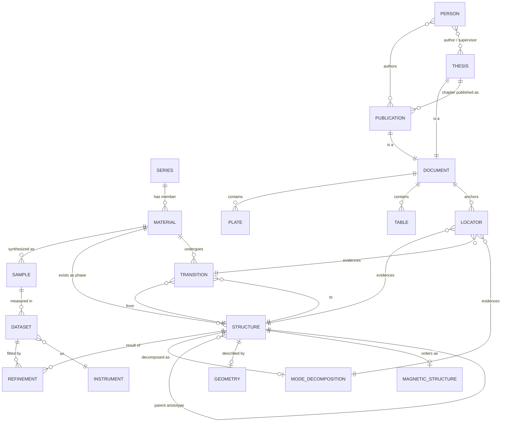

# Perovskite Atlas

**A knowledge base of thirty years of perovskite research: every structure, refinement, mode decomposition, phase transition, figure, table, article and thesis, with each number traceable to the page it came from.**

This document proposes a redesign of the current MatDB project. It keeps what the first approach got right (a relational view of materials, structures, refinements and modes, and the four thesis extractions with evidence pointers) and replaces what does not work (an ICSD-imitating page full of empty fields, a hand-seeded SQLite that is the source of truth, a dark Bootstrap theme that belongs to no one). It is written to give the project a mid-term horizon of roughly eighteen months, in phases that each leave a usable, published site.

---

## 0. The proposal in eight lines

1. **Plain-text source of truth in git**, machine-built SQLite/Parquet, generated website. The same three-layer architecture as thermomat and jmi-db, so the tooling and the mental model are shared across the family.
2. **The phase is the atom**: a structure at given conditions (T, P, x) with its cell, atoms, CIF, refinement and mode decomposition. Materials are identities; series group them; transitions connect them.
3. **Every value carries a locator** (document → page → table/figure → cell) and a status (published, thesis-only, re-derived, unverified). Thesis-only results become a visible, searchable product rather than a lost byproduct.
4. **The mode-decomposition kit** is stored per structure: parent CIF, child CIF, transformation matrix, setting, software, convention and output. Anyone can redo the decomposition.
5. **Figures and tables are entities** ("plates"): cropped locally from the PDFs at full resolution, captioned, typed, linked to materials, structures and transitions, and, where recoverable, to the data behind them.
6. **Verification is computational**: a CIF rebuilt from a thesis table must reproduce the reported bond lengths and angles; a re-run decomposition must reproduce the reported amplitudes. Extraction errors surface as physics disagreements.
7. **Analyses are first-class**: tidy tables and notebooks answer cross-corpus questions (transition temperature vs tolerance factor, mode amplitude vs A-site radius, phase-transition routes by composition).
8. **The site is a sibling of emissivity.org and thermomat**: `theme: none`, the family tokens and type system, its own palette, no Bootstrap, no gradients, no fake counters.

---

## 1. What exists today, and why it does not satisfy

### 1.1 Inventory of the current project

| Asset | State |
|---|---|
| Theses (PDF + Mathpix Markdown) | 4 (Gateshki 2003, Faik 2009, Iturbe-Zabalo 2012, Orayech 2015), 1.75 MB of Markdown |
| Figures referenced in thesis Markdown | 386 (75 / 104 / 116 / 91), all pointing at `cdn.mathpix.com` URLs |
| Table rows in thesis Markdown | 2,938 (316 / 511 / 1,068 / 1,043) |
| Articles available locally (PDF + Markdown) | 28 (17 thesis-linked, 11 recovered from ORCID) |
| ORCID works | 95, of which roughly 45 concern perovskites, phase transitions or mode crystallography |
| Per-thesis extraction files (`0N_thesis_*.qmd`) | 4, with "Evidence: Thesis 3 → Ch 5 → Table 5.4" locators |
| SQLite tables | 24 defined |
| Materials / structures / refinements rows | 129 / 72 / 70 |
| Symmetry analyses / irreps / mode parameters rows | 8 / 12 / **0** |
| Strain modes / mode couplings / atomic mode displacements / provenance rows | **0 / 0 / 0 / 0** |
| Files registered | 27, all PDFs. **No CIF, no pattern, no PCR, no AMPLIMODES output** |
| Materials covered by an identified article | 61 of 128 |

### 1.2 Diagnosis

**The schema is aspirational, the data is thin.** Twenty-four tables were designed top-down; nine of them are empty, and the one thing the group is known for, mode crystallography, has zero mode parameters. The database looks complete and is not.

**The database is the source of truth, and it should not be.** Values were typed into SQL seed files by hand (`seed_brahim_demo.sql`, `seed_inventory.sql`). There is no round trip to the source page, no diff a human can read, no way to review a batch of numbers before they enter. The evidence pointers in the extraction files, which are the most valuable thing produced so far, never reached the database: the `provenance` table has no rows.

**The material page imitates ICSD.** Tabs for Overview, Full Profile, Publications, Samples, Structures, Patterns, Refinements, Modes, Files, Tags, Provenance; fields for CAS number, IUPAC name, band gap, superconducting T<sub>c</sub>. For Sr<sub>2</sub>CoWO<sub>6</sub> almost every field is blank. A page that is mostly empty labels tells the reader nothing about what is actually known. The unit of the page is also wrong: a material has several phases, and the interesting object is the phase at a temperature, not the formula.

**Identity is fuzzy.** `CaPr2CuTi209` (typo) sits beside `CaPr2CuTi2O9`; `Sr2Cd(1-x)CaxWO6` is a material and so are its eight members; `Sr2WO5` (an impurity) is a material like the others. There is no notion of a series with a variable slot, no composition map, no way to say "all A<sub>2</sub>BB'O<sub>6</sub> with B' = W".

**Figures are external and ephemeral.** Every figure in the thesis Markdown is a Mathpix CDN crop. Those URLs will expire. Nothing has been cropped locally, captioned, or linked to a material.

**Two rendering paths.** Some pages query SQLite in Python at render time; others load the whole `.sqlite` in the browser through sql.js. Neither is wrong at this scale, but having both doubles the surface to maintain.

**The visual identity is borrowed.** Bootstrap "darkly" plus a gradient hero, Font Awesome icons, animated counters hard-coded to 156 / 423 / 89 / 287. The family sites are light, institutional, metrology-grade; this one is a SaaS landing page.

**Repository hygiene.** `_site/` is committed, 245 files in `materials/` are half `.qmd` and half `.quarto_ipynb` cache, and a `z_materials_copy.zip` sits at the root.

None of this is wasted. The extraction files, the ORCID harvest, the article PDFs, the inventory CSV and the schema's *vocabulary* (irreps, amplitudes, normalization conventions, Glazer notation, strain modes) all carry forward.

---

## 2. Design principles

1. **Text in git is the source of truth.** Entity files (YAML front matter in `.qmd` or plain `.yaml`), CIFs, CSV tables and PNG plates live in the repository. The SQLite file, the Parquet tables, the JSON API and the HTML site are *computed* and never hand-edited. Any script may rebuild everything from the sources. (This is the thermomat "three layers, non-mutation" rule, already proven in jmi-db.)
2. **Evidence before value.** A number without a locator does not enter the source layer. A locator is a document id, a page, a table or figure id, and optionally a row/column and a pixel box. The site can show the crop of the page for any value.
3. **Status is explicit.** `published` (appears in a paper), `thesis-only` (appears only in a thesis), `re-derived` (computed by our pipeline from stored inputs), `unverified` (extracted, not yet confronted). Status is displayed, filterable and counted.
4. **The phase is the unit.** Structures carry conditions. Materials aggregate structures. Series aggregate materials by a variable slot. Transitions connect two structures of the same material.
5. **Recomputability.** Anything derived (tolerance factor, cell volume, tilt angles, bond-valence sums, Glazer system, group–subgroup index, mode decomposition) is recomputed by the pipeline from stored inputs and compared with the reported value. Disagreement is a flag, not an error.
6. **Everything is an entry.** Structures, transitions, figures, tables, datasets, publications, theses, people and instruments share the same envelope: id, title, date, creators, type, tags, sources, status. New kinds (Raman spectra, magnetic structures, high-pressure runs, calorimetry) are added by adding a type, not by redesigning.
7. **FAIR by construction.** Stable ids, JSON per entity, CIF export, BibTeX export, a static OPTIMADE-style endpoint, a Zenodo DOI per release, CC-BY licence. The atlas should be citable and machine-readable from the first public release.
8. **A sibling, not a stranger.** Same design kit as emissivity.org and thermomat: `theme: none`, tokens, Source Serif 4 / Source Sans 3 / IBM Plex Mono, 1180 px frame, 4 px topline, serif wordmark with accent suffix, hairline rules, 2 px radii, no shadows. Own palette.

---

## 2b. Alternatives considered

The first approach is one of five reasonable architectures. They were weighed against four criteria: fidelity to the sources (can every number be traced?), longevity (will it be readable in 2040 without a running service?), effort to reach a first useful release, and fit with the family of sites already built.

| Architecture | What it looks like | Strengths | Why not (or why yes) |
|---|---|---|---|
| **A. Database-first** (the current MatDB) | SQLite is the truth; Quarto pages query it; seeds are SQL | Relational queries from day one; one file | Hand-typed seeds are unreviewable; provenance is optional and ended up empty; the schema outran the data; SQL diffs are unreadable; the site and the data are coupled |
| **B. Server application** | PostgreSQL + a web app (Django/FastAPI + React), admin forms for data entry, API | Proper forms, permissions, multi-user editing, live queries | A running service to maintain for decades; data entry through forms is slower than reviewing a batch file; overkill for a corpus of hundreds of structures; breaks the static-site family |
| **C. Knowledge graph** | RDF/JSON-LD triples or Neo4j; ontologies (CIF dictionaries, EMMO, CHMO) | Maximum expressiveness; standards-aligned; SPARQL | Modelling cost is high and mostly invisible to a reader; tooling is heavy; the graph is easily *derived* from typed entity files later, so it belongs in the computed layer, not the source |
| **D. Deposit into existing platforms** | CIFs to COD/ICSD, datasets to Zenodo, papers on ORCID, a Jupyter Book of analyses | Zero infrastructure; instant citability; discoverability in the field | Those platforms hold structures, not the reasoning, the transitions, the modes, the plates or the thesis-only results; they are export targets, not the home |
| **E. Text-in-git knowledge base** (this proposal) | Typed entity files + CIF + CSV + PNG in git; validated; derived SQLite/Parquet/JSON; generated static site in the family kit | Every value reviewable in a diff; evidence enforced by schema; no service to keep alive; computed layer gives A's queries and C's graph and D's exports for free; same pattern as thermomat and jmi-db | Referential integrity lives in scripts, not the engine; scale ceiling in the low thousands of records (well above this corpus); needs discipline to keep hand-editing out of the computed layer |

**Verdict.** E, with D as its export layer and C as a derived artefact if ever wanted. A is what you have and is the weakest on fidelity and longevity. B is the only alternative that would win on multi-user data entry, and that need can be met in E with the review-queue CSV and pull requests, which also give you a permanent audit trail that a form never does.

What E changes relative to your approach, concretely: the unit becomes the phase, not the material; the database becomes an output, not an input; every number carries a locator or is rejected by the validator; figures and tables become entities; the mode decomposition becomes a reproducible kit; and the site inherits the family kit rather than a Bootstrap theme.

---

## 3. The knowledge model

### 3.1 Entities

| Entity | What it is | Key fields | Examples from the corpus |
|---|---|---|---|
| **Series** | A parametric family with one or more variable slots | template formula, slots and their allowed values, structural family (double, triple, layered, simple), parent aristotype | Sr<sub>2</sub>{M}WO<sub>6</sub> (M = Ni, Zn, Co, Cu, Ca, Cd, Mg); Sr{Ln}{M}RuO<sub>6</sub>; {A}Ln<sub>2</sub>CuTi<sub>2</sub>O<sub>9</sub>; Sr<sub>2</sub>{M}SbO<sub>6</sub>; Sr<sub>2</sub>Co<sub>1−x</sub>Mg<sub>x</sub>TeO<sub>6</sub> |
| **Material** | A composition identity | canonical formula, composition map, site assignment (A, A′, B, B′, X), oxidation states, series membership and slot values, synthesis summary, status (primary, impurity, failed) | Sr<sub>2</sub>CoWO<sub>6</sub>; SrNdZnRuO<sub>6</sub>; Bi<sub>2</sub>CrFeO<sub>6</sub> (failed synthesis, Appendix C of thesis 3) |
| **Sample** | A synthesized batch | material, route, precursors, thermal schedule, purity, impurity phases with fractions, who and when | Sr<sub>2</sub>NiWO<sub>6</sub>: 97.0 %, 0.8 % SrWO<sub>4</sub>, 2.2 % Sr<sub>2</sub>WO<sub>5</sub> |
| **Dataset** | A measurement | sample, technique (XRPD, SXRPD, NPD, Raman, DSC, magnetization, TEM), instrument and facility, radiation and wavelength, conditions (T range, P), date, raw file if kept | NPD at D2B / ILL; SXRPD at BM25 / ESRF |
| **Structure** | A phase at conditions | material, T, P, x, space group (HM, number, setting), cell, atoms (Wyckoff, fractional coordinates, occupancy, B<sub>iso</sub> / U), CIF, is-parent flag, relation to aristotype | SrNdCoRuO<sub>6</sub> at 653 K, P4<sub>2</sub>/n |
| **Refinement** | How the structure was obtained | dataset, structure, software and version, method (conventional, symmetry-mode), refined parameters, R<sub>p</sub>, R<sub>wp</sub>, R<sub>exp</sub>, R<sub>Bragg</sub>, χ², constraints, notes | "all modes refined" vs "3 modes refined" (thesis 3, Table 7.3) |
| **ModeDecomposition** | Symmetry-mode analysis of a structure | parent structure, child structure, transformation (P, p), software (AMPLIMODES, ISODISTORT), normalization convention, irreps (label, k-vector, dimension, isotropy subgroup, amplitude with σ, is-primary), modes per irrep (Wyckoff, species, amplitude), total amplitude, output file | SrNdZnRuO<sub>6</sub> RT: Γ<sub>4</sub><sup>+</sup> 1.200 Å, X<sub>3</sub><sup>+</sup> 0.855 Å, X<sub>5</sub><sup>+</sup> 0.425 Å (parent Fm-3m) |
| **Transition** | A phase change | material, from-structure, to-structure, T or P, order (continuous, discontinuous), reversibility, technique(s) that evidence it, primary irrep, Landau notes | SrNdZnRuO<sub>6</sub>: P2<sub>1</sub>/n → P4<sub>2</sub>/n at 740 K (discontinuous) → Fm-3m at 1060 K (continuous) |
| **Geometry** | Derived structural descriptors | structure, tilt angles (ψ, φ, Glazer system), octahedral volumes, bond lengths, bond angles, bond-valence sums, distortion indices, tolerance factor(s) | thesis 3 Table 5.2 |
| **MagneticStructure** | Ordered magnetic phase | structure, propagation vector, irreps, moments per site, T<sub>N</sub> or T<sub>C</sub> | SrLaCoRuO<sub>6</sub>: k = (½, 0, ½), Co 1.3 μ<sub>B</sub>, Ru 0.9 μ<sub>B</sub> |
| **Finding** | A stated result that is not a number | type (ordering degree, pseudosymmetry, negative result, methodological), text, entities involved, evidence | "No single irrep breaks Fm-3m to P2<sub>1</sub>/n; Γ<sub>4</sub><sup>+</sup> and X<sub>3</sub><sup>+</sup> must couple" |
| **Plate** (figure) | A figure from a document | document, page, figure number, caption, kind (Rietveld plot, cell vs T, amplitude vs T, structure drawing, mode drawing, Raman, magnetization, DSC, phase diagram, photo), materials and structures shown, pixel box, local PNG/SVG, digitized data if any | thesis 3 Fig 5.12 (transition temperatures) |
| **Table** | A table from a document | document, page, table number, caption, CSV of the cells, which entities were extracted from it | thesis 3 Table 5.4 → 4 ModeDecompositions |
| **Publication** | Article, proceedings, book | jmi-db publication schema (DOI, OpenAlex id, authors, journal, year, PDF, verification source) | 25 articles + 4 theses today |
| **Thesis** | A doctoral thesis with chapters | author, year, language, chapter map (chapter → materials, structures, plates, tables), published-in map (chapter → publications), thesis-only results | 4 |
| **Person** | Author, student, collaborator | jmi-db person schema (name variants, ORCID, roles with dates) | Gateshki, Faik, Iturbe-Zabalo, Orayech, Igartua, … |
| **Instrument** | Diffractometer, spectrometer | facility, type, radiation, typical λ | D2B (ILL), BM25 (ESRF), lab Bruker |

### 3.2 Relationships



### 3.3 Identifiers

Stable, human-readable, lowercase, never reused:

| Kind | Pattern | Example |
|---|---|---|
| material | `mat:<formula-slug>` | `mat:sr2cowo6`, `mat:srndznruo6`, `mat:sr2cd0.5ca0.5wo6` |
| series | `ser:<template-slug>` | `ser:sr2-m-wo6`, `ser:sr-ln-m-ruo6` |
| structure | `str:<material>.<sg-slug>.<T>k[.<x>].<source>` | `str:srndcoruo6.p42n.653k.iturbe2012` |
| transition | `trn:<material>.<from-sg>-<to-sg>.<source>` | `trn:srndznruo6.p21n-p42n.iturbe2012` |
| mode decomposition | `mod:<structure-id>` | `mod:srndznruo6.p21n.300k.iturbe2012` |
| document | `doc:thesis-03`, `doc:<doi-slug>` | `doc:10.1107-s0021889813013253` |
| plate / table | `plt:<doc>.<n>`, `tbl:<doc>.<n>` | `plt:thesis-03.5.12`, `tbl:thesis-03.5.4` |
| person | `per:<surname-initials>` | `per:iturbe-zabalo-e` |

Formula canonicalization: keep the perovskite site order as written by the group (A<sub>2</sub>BB′O<sub>6</sub>, not Hill order), store a `composition` map for search and a `sites` map (A, A′, B, B′, X) for analysis. Solid solutions are series with a numeric slot; each measured x is a member material.

### 3.4 The locator

```yaml
evidence:
  - doc: doc:thesis-03
    page: 112
    table: "5.4"
    cell: {row: "GM4+", col: "SrNdZnRuO6"}
    bbox: [287, 1475, 1479, 904]      # px on the page render, for the crop
    status: thesis-only
  - doc: doc:10.1016-j.jssc.2012.10.012
    page: 27
    table: "3"
    status: published
```

A value can have several locators (thesis and paper). The pipeline renders a crop for every locator with a bbox, and the site shows it on demand next to the value.

### 3.5 The mode-decomposition kit

Per structure, a folder that lets anyone redo the analysis:

```
structures/srndznruo6.p21n.300k.iturbe2012/
  structure.yaml        # conditions, cell, space group, evidence, status
  child.cif             # the refined structure (rebuilt from the table, or original if kept)
  parent.cif            # the aristotype in the setting used (Fm-3m, a ≈ 7.9 Å)
  transformation.yaml   # (P, p): "a+b, a-b, 2c; 0,0,1/4" plus the matrix
  modes.yaml            # irreps, amplitudes, convention, software, version
  amplimodes.out        # original output if kept; else the re-run output
  refinement.yaml       # R factors, software, method, dataset id
  geometry.yaml         # tilts, distances, angles, BVS as reported
```

The pipeline recomputes the decomposition when a parent, child and transformation are present (see § 5.4) and writes the result to the computed layer with a comparison.

---

## 4. Repository layout and pipeline

### 4.1 Layout

```
perovskite-atlas/
  _quarto.yml
  assets/                  # family kit: styles/theme.css, includes/*.html, icons
  _schemas/                # JSON Schema per entity + INTERFACES.md
  _scripts/                # pipeline (python), one module per stage
  _data/
    config.yml             # entity types, kinds, controlled vocabularies, radii tables
    computed/              # atlas.sqlite, parquet/, json/, crops/, reports/  (never edited)
  sources/                 # documents: theses/, articles/ (PDF + OCR md), raw/ (if any)
  series/      <slug>.yaml
  materials/   <slug>/index.qmd          # YAML front matter + optional prose
  samples/     <slug>.yaml
  datasets/    <slug>.yaml
  structures/  <id>/                     # the kit (see § 3.5)
  transitions/ <id>.yaml
  magnetic/    <id>.yaml
  findings/    <id>.yaml
  plates/      <doc>/<n>/ {plate.png, plate.yaml, data.csv?}
  tables/      <doc>/<n>/ {table.csv, table.yaml}
  publications/ <slug>/index.qmd         # jmi-db schema, reused as is
  theses/      <slug>/index.qmd          # + chapters.yaml
  people/      <slug>/index.qmd
  instruments/ <slug>.yaml
  notebooks/   *.qmd                     # reproducible analyses
  _gen/                                  # generated pages (ignored by git)
  _site/                                 # ignored by git
```

### 4.2 Pipeline

```mermaid
flowchart LR
  S[sources/ PDFs] --> C[crop plates & tables]
  C --> X[extract with locators]
  X --> R[review queue CSV]
  R --> E[entity files in git]
  E --> V[validate: schema, refs, units, space groups, CIF parse]
  V --> D[derive: t, V, tilts, BVS, Glazer, decompositions]
  D --> K[confront: reported vs recomputed]
  K --> B[build: sqlite, parquet, json, bibtex, cif zip]
  B --> G[generate pages -> _gen/]
  G --> Q[quarto render]
  Q --> A[audit: orphans, missing evidence, coverage]
  A --> P[publish: Netlify + Zenodo release]
```



`make validate` halts on any schema or reference error; the site never renders from inconsistent data. `make confront` never halts; it writes `_data/computed/reports/confrontation.md` listing every value whose recomputed counterpart disagrees beyond its σ.

---

## 5. Ingestion: turning theses and papers into data

This is the heart of the project and the part that deserves the most method. The theses hold more than the papers: intermediate temperatures, failed syntheses, full atomic-position tables for every temperature, all modes rather than the three primary ones, bond geometries, magnetic models, and the reasoning. Four stages, each with a verification loop.

### 5.1 Stage A: plates and tables, locally and forever

- Render every PDF page at 300 dpi (`pdftoppm`).
- Detect figure and table regions (PyMuPDF blocks + the Mathpix Markdown, which already marks the crops with pixel boxes in its URLs: `height=682&width=986&top_left_y=1288&top_left_x=534`). Those URL parameters are the bounding boxes; they can be reused to crop locally before the CDN links die.
- Write `plates/<doc>/<n>/plate.png` and `plate.yaml` with caption (from the "Figure N.N:" line that follows), page, bbox, kind (classified by a small model or by hand) and materials named in the caption.
- Write `tables/<doc>/<n>/table.csv` from the Markdown pipe tables, plus `table.yaml` with caption and page. Cells keep their uncertainty notation as text (`5.5570(1)`) and are parsed into (value, σ) by the pipeline.

Output: about 650 plates and about 180 captioned tables, all local, all searchable, before any structural data is entered. This alone is a publishable site.

### 5.2 Stage B: schema-constrained extraction with review

- For each chapter, an LLM pass fills the entity schemas from the Markdown *and* the page images, and must emit a locator for every value. The prompt is the schema; the output is YAML.
- The result goes to a review CSV per batch, in the style of the ORCID reconciliation flow already used in jmi-db (`approve`, `fix`, `reject`, notes). Nothing enters `structures/` without a human tick.
- A second, independent pass (the "confrontation" pass of the thesis-review method) compares the first pass against the page image and marks disagreements.

The existing four extraction files are the seed for this stage: they already contain the materials, the RT cells, the primary irreps and the transition sequences with locators in prose form.

### 5.3 Stage C: rebuilding CIFs and checking them against physics

From a thesis table with space group, cell and atomic positions, the pipeline writes a CIF (pymatgen or gemmi). Then it computes bond lengths, bond angles, octahedral volumes and bond-valence sums from that CIF and compares them with the geometry table the thesis reports (for example Table 5.2 of thesis 3: M–O1 2.031(4) Å, Ru–O1–M 158.7(2)°, BVS Ru 4.82(3)).

If the recomputed values agree within reported σ, the atomic positions, the cell, the space-group setting and the origin choice are all verified at once. If they do not, the disagreement points at the exact error (a swapped coordinate, a wrong setting, an OCR digit). This is the strongest verification available and it costs nothing beyond the code.

### 5.4 Stage D: re-deriving the mode decompositions

With parent CIF, child CIF and transformation stored, the decomposition can be redone. Options, in order of effort:

1. **Manual re-run on the Bilbao AMPLIMODES server** for a sample of structures, storing the output file in the kit. Confirms conventions and catches setting errors.
2. **Scripted ISODISTORT** (the server accepts form posts; several small Python wrappers exist) for batch re-derivation, mapping ISODISTORT's normalization to the AMPLIMODES values reported.
3. **In-house projection** onto symmetry-adapted displacement bases using the group representations (spglib for symmetry, a small irrep-projection module). Mid-term, this makes the atlas independent of external servers and allows amplitude-vs-T curves to be regenerated from stored structures.

Reported amplitudes that are reproduced are marked `re-derived`; the comparison is shown on the structure page.

### 5.5 Stage E: original data, if it still exists

The most valuable addition would be the original FullProf `.pcr`/`.dat` files, the ILL and ESRF raw patterns, and the AMPLIMODES outputs from 2003–2015. If any survive on old disks, they enter `sources/raw/` with checksums and become Datasets; patterns can then be plotted on the structure page and refinements re-run. **This is the first question to settle (§ 11).**

### 5.6 Order of ingestion

Theses 3 and 4 first (English, mode data, most tables), then the articles that correspond to their chapters (to set `published` vs `thesis-only`), then theses 2 and 1 (Spanish, tungstates and antimonates, the conventional-refinement era), then the eleven articles outside the theses, then the older non-perovskite work if scope is extended.

---

## 6. The website

### 6.1 Information architecture

Header: wordmark, then **Series · Materials · Structures · Transitions · Modes · Plates · Publications · Theses · Data · Notebooks · About**. Footer with the family grid (About, Browse, Data, Colophon).

### 6.2 Home

Not a hero. A one-sentence mission in serif, the real counts (computed at build), and the most characteristic object in this subject's world: a **composition grid**. Rows are B′ cations (W, Sb, Te, Ru, Ti…), columns are B cations (Ni, Zn, Co, Cu, Ca, Cd, Mg, Mn, Fe, Sc, Ga, In, Al, Cr, Ln…), cells are the A-site variants studied, tinted by RT space group. It is the group's thirty years in one figure, and every cell is a link.

Below it: a "phase-route" strip per series (see § 6.3), recently added structures, and the thesis-only results counter as a visible promise.

### 6.3 Series page

The way the group actually thinks. A comparison table across members: tolerance factor (both conventions), RT space group, transition temperatures, high-symmetry phases, primary irrep amplitudes at RT, purity. Under it, two plots generated from data: transition temperature vs tolerance factor, and Γ<sub>4</sub><sup>+</sup> / X<sub>3</sub><sup>+</sup> (or R<sub>4</sub><sup>+</sup> / M<sub>3</sub><sup>+</sup>) amplitude vs A- or B-site radius. Then the **phase-route strip**: one horizontal temperature axis per member with coloured segments for each phase (P2<sub>1</sub>/n → P4<sub>2</sub>/n → Fm-3m, or P2<sub>1</sub>/n → R-3 → Fm-3m, or I4/m → Fm-3m). Routes are the scientific story of these compounds and no existing database shows them.

### 6.4 Material page

- Identity block: formula (typeset), composition, sites, oxidation states, series membership, tolerance factor(s), synthesis summary, purity, impurities, status.
- Phase-route strip for this material.
- Structures table: T, space group, cell, R<sub>wp</sub>, source, status; each row links to a structure page.
- Transitions list with order and evidence plate.
- Plates: every figure showing this material, thumbnails with kind badges.
- Sources: publications and thesis chapters; a "thesis-only results" panel listing what appears only in the thesis.
- Only fields that have values are rendered. Absence is stated once ("No magnetic data") rather than as a column of blanks.

### 6.5 Structure page (the atom of the site)

- Header: material, space group with number and setting, T, P, source, status badge, evidence crop toggle.
- Cell and atoms table with σ, tabular numerals, download CIF.
- 3D view (3Dmol.js loading the CIF client-side) with octahedra drawn.
- Refinement panel: dataset, instrument, software, method, R factors, χ²; pattern plot when data exists.
- **Mode panel**: parent, transformation, convention, bar chart of amplitudes by irrep (primary irreps emphasised), isotropy subgroups, per-mode table; "recomputed" column when available.
- Geometry panel: tilt angles and Glazer system, bond lengths and angles, BVS, reported vs recomputed.
- Evidence footer: every locator, with page crops.

### 6.6 Transitions page

Global table of every transition (material, from, to, T, order, technique, primary irrep, source), filterable, and a plot of T vs tolerance factor coloured by route type. Each row opens the transition record with its evidence plate (the cell-vs-T or amplitude-vs-T figure that established it).

### 6.7 Modes explorer

Pick an irrep (Γ<sub>4</sub><sup>+</sup>, X<sub>3</sub><sup>+</sup>, X<sub>5</sub><sup>+</sup>, R<sub>4</sub><sup>+</sup>, M<sub>3</sub><sup>+</sup>…) and see its amplitude across all structures, vs T, vs tolerance factor, vs radius; filter by parent, by series, by convention. A Bärnighausen-style group–subgroup tree per parent (Fm-3m and Pm-3m), drawn as SVG from data, with the observed structures placed on it. The Glazer tilt-system table with the materials found in each.

### 6.8 Plates gallery

All figures and tables, filterable by kind, material, series, document, year. Each plate page: image at full resolution, caption, locator, entities shown, "data behind this figure" link when a table or a digitized CSV exists, and citation. Plates from theses and plates from papers that show the same result are linked as variants.

### 6.9 Publications and theses

Publications reuse the jmi-db schema and the ORCID/OpenAlex harvest pipeline unchanged (it already produced the 2007 Acta A entry with provenance). Each publication page lists the materials, structures, transitions and plates extracted from it. Each thesis page has a chapter map: chapter → materials → structures → plates → the paper it became, and the list of results that never became a paper.

### 6.10 Data and API

Downloads: `atlas.sqlite`, Parquet per entity, one JSON per entity, all CIFs as a zip, BibTeX, the plates as a zip. A static OPTIMADE-style `/v1/structures` JSON so materials-science tooling can consume the atlas. A **Query page** that runs DuckDB-WASM in the browser over the Parquet files: real SQL, no server, with a handful of saved queries ("all P2<sub>1</sub>/n structures with X<sub>3</sub><sup>+</sup> > 0.7 Å"). Release notes and the Zenodo DOI.

### 6.11 Notebooks

Quarto notebooks, rendered with their code, one per analysis (§ 7). They read the computed Parquet files, so anyone can rerun them.

### 6.12 Search

Pagefind index over generated pages, with formula normalization so `Sr2CoWO6`, `Sr₂CoWO₆` and `Sr2 Co W O6` all hit, and space-group aliases (`P21/n`, `P2_1/n`, `P 21/n`, No. 14).

---

## 7. What the corpus can answer once it is tidy

These are the analyses that justify the word "database" and give the project scientific weight beyond archiving:

1. **Transition temperature vs tolerance factor** across all A<sub>2</sub>BB′O<sub>6</sub> studied (roughly forty compounds with at least one measured transition), separated by route type. The group has drawn this for single series; the atlas draws it for the whole corpus.
2. **Primary-mode amplitude at RT vs A-site and B-site radius**, and vs tolerance factor, for both aristotypes (Fm-3m for ordered doubles, Pm-3m for disordered and simple). Tests how far tilt amplitude is a geometric function of composition.
3. **Phase-route map**: which sequence (P2<sub>1</sub>/n → I4/m → Fm-3m; → P4<sub>2</sub>/n → Fm-3m; → R-3 → Fm-3m; → I2/m → …) occurs as a function of t and of the B/B′ charge and size difference. This is a result in itself.
4. **Order of transitions vs amplitude evolution**: continuous vs discontinuous transitions against the temperature dependence of the primary amplitude (Landau-style exponents where enough temperatures exist).
5. **Cation-ordering degree vs charge difference and size difference** at the B site.
6. **Bond-valence sums and distortion indices** by cation and by phase, including the systematic M over-bonding noted in thesis 3.
7. **Refinement-quality distribution** by instrument, radiation and era; secondary-mode amplitude reliability ("all modes" vs "primary modes" refinements).
8. **Thesis vs paper**: fraction of structures, temperatures and modes that exist only in theses; a quantitative argument for the atlas.
9. **Bibliometrics** of the corpus: materials per paper, co-authorship, citations (from the jmi-db citation pipeline).

Each notebook's figures follow the ThesisFigures rules (LaTeX-rendered text, fixed axes across a series, one colour per meaning, tabular alignment) so they can be dropped into a slide or a paper.

---

## 8. Visual identity

### 8.1 Kit

Copy `assets/styles/theme.css` and the three includes (`fonts.html`, `site-header.html`, `site-footer.html`) from thermomat, keep the Quarto-chrome reset block intact, wrap prose in `.page-article`, and swap the tokens and the wordmark. `theme: none`, `navbar: false`, `search: false`, KaTeX for math.

### 8.2 Tokens (proposal)

The palette comes from the group's own structure drawings: Ru octahedra in blue, Co octahedra in gold, cations green, oxygens red. Emissivity is navy and brass on cool paper; thermomat is oxide and steel on warm paper; the atlas is **octahedron teal and gold on a cool-green paper**, with oxygen red reserved for status.

| Token | Light | Dark | Role |
|---|---|---|---|
| `--ink` | `#1f2422` | `#e6e9e7` | text |
| `--ink-soft` | `#535b58` | `#b3bab7` | secondary text |
| `--ink-faint` | `#7f8884` | `#8a918e` | captions, labels |
| `--paper` | `#ffffff` | `#15191a` | page |
| `--tint` | `#f3f6f4` | `#1c2221` | bands, table stripes |
| `--line` | `#d6ddd9` | `#2f3736` | hairlines |
| `--octa` | `#2f6b5e` | `#6fb3a2` | primary: links, topline, wordmark accent |
| `--gold` | `#a8842f` | `#d3ad5a` | secondary: current nav, primary irreps, highlights |
| `--oxy` | `#b03a2e` | `#e07b6f` | status: unverified, thesis-only badges, confrontation flags |

### 8.3 Wordmark and name

Working title **Perovskite Atlas**; wordmark `perovskite<span class="accent"> atlas</span>` with the sub-line "Structures, modes and phase transitions · UPV/EHU". Alternatives worth considering: **Oktaedro** (Basque, octahedron; short, own), **Tilt** (the physics in one word). The choice is yours; the wordmark pattern is fixed by the kit.

### 8.4 Type

Source Serif 4 for headings, the mission line and pull-quotes; Source Sans 3 for everything read; IBM Plex Mono for formulas as identifiers, space-group symbols, ids and code. Formulas in prose are typeset with subscripts (Sr<sub>2</sub>CoWO<sub>6</sub>), in tables as mono (`Sr2CoWO6`) so columns align. Numbers everywhere in `tabular-nums`.

### 8.5 Figures on the site

Generated plots share one style sheet derived from the tokens (teal primary series, gold secondary, red flags) and the ThesisFigures rules: identical axis windows within a series, LaTeX labels, one colour per meaning. Plates from documents are shown as they are, with a hairline frame and the caption in the caption style of the kit.

---

## 9. Tech stack

| Layer | Choice | Why |
|---|---|---|
| Site | Quarto website, `theme: none`, family kit | Sibling of emissivity.org, thermomat, tfgs, igartua-site |
| Source files | YAML front matter `.qmd` + `.yaml` + CIF + CSV + PNG | Git-diffable, human-editable, jmi-db conventions |
| Validation | JSON Schema (`_schemas/`), Python `jsonschema` + custom checks | Same as jmi-db |
| Crystallography | pymatgen, gemmi, spglib | CIF write/read, symmetry, geometry, BVS |
| Derived data | pandas + pyarrow → Parquet, SQLite via Python | Simple, portable, no server |
| Browser query | DuckDB-WASM over Parquet; sql.js retired | Real SQL client-side |
| 3D | 3Dmol.js | Loads CIF directly, octahedra rendering |
| Plots | matplotlib (static SVG, ThesisFigures rules) for notebooks; small inline SVG generated at build for strips and bars | Consistent, fast, no runtime dependency for core pages |
| Search | Pagefind | Static, fast, no server |
| Page generation | Python → `_gen/*.qmd` (as thermomat/jmi-db), or Quarto EJS listings for simple lists | Proven pattern |
| Build | `Makefile` with `ingest`, `validate`, `derive`, `confront`, `build`, `generate`, `render`, `audit`, `publish` | Same verbs as the siblings |
| Hosting | Netlify (family) or GitHub Pages | Static |
| Archival | Zenodo release per tag, CC-BY-4.0 data, MIT code | Citable |

---

## 10. Roadmap (mid-term, about eighteen months)

Each phase ends with a deployed site that is better than the previous one.

**Phase 0 · Foundations (2–3 weeks).** Decisions in § 11. New repository `perovskite-atlas`, family kit ported and retinted, schemas v0.1 for Series, Material, Structure, Transition, Plate, Table, Publication, Thesis, Person. Publications and people migrated from jmi-db and the current ORCID JSON. Makefile with the pipeline verbs stubbed. Skeleton site live.

**Phase 1 · Plates, tables and the map (1–2 months).** Stage A on the four theses and 28 articles: about 650 plates and 180 tables cropped, captioned, typed and linked to materials. Series and materials entered from the inventory CSV with proper identity (typos fixed, solid solutions modelled, impurities typed). Composition grid on the home page. Plates gallery, series pages, material pages with what is known so far. Coverage and evidence audits running.

**Phase 2 · Structures and modes from theses 3 and 4 (2–3 months).** Stages B, C and D on the English theses: every structure at every temperature, every mode decomposition, every transition, geometry tables. CIF rebuild with physics confrontation. Structure pages with 3D view and mode panel. Transitions page. First notebooks (T vs t, amplitude vs radius). The corresponding papers linked; `published` vs `thesis-only` set.

**Phase 3 · The tungstate and antimonate era (2 months).** Theses 1 and 2 (Spanish), the Cd/Ca, Mn tungstates, the Ln antimonates, the Ca<sub>2−x</sub>Sr<sub>x</sub> solid solutions. Pseudosymmetry results from the 2003 work. Remaining articles. Original raw data ingested if found.

**Phase 4 · Analysis and openness (2 months).** Notebooks for § 7 complete. Data page with SQLite, Parquet, JSON, CIF zip, OPTIMADE-style endpoint, DuckDB-WASM query page. First Zenodo release. Modes explorer with group–subgroup trees.

**Phase 5 · Extension (ongoing).** Beyond perovskites in the same envelope: high-pressure Raman work, the BaSrMWO<sub>6</sub> and La<sub>1−x</sub>Sr<sub>x</sub>FeO<sub>3−x</sub>F<sub>x</sub> collaborations, the 1990s molecular-crystal phase transitions (calorimetry, Raman) as Findings and Plates. Student contributions through pull requests with the review queue. In-house mode projection replacing external servers.

### Ideal-state criteria (what "done" means for the first public release, end of Phase 4)

- Every structure in the four theses is present, with cell, atoms, CIF, refinement and evidence; none without a locator.
- Every reported bond length and BVS is recomputed from the CIF; disagreements beyond 3σ are listed in the confrontation report and either explained or fixed.
- Every mode decomposition has a parent, a transformation and a convention; at least one per series is re-derived and matches.
- Every figure and table in the four theses and 28 articles exists locally as a plate or table with a caption and a page.
- Every publication is linked to at least one material or a Finding; every thesis chapter is mapped to its paper or marked thesis-only.
- The site renders with `theme: none` and the family kit, passes the audit with zero orphans, and is deployed with a Zenodo DOI.
- The nine analyses in § 7 exist as notebooks reading only computed files.

---

## 11a. Decisions taken (2026-09-26)

The eight questions below were answered on 2026-09-26. What each answer changes:

| # | Decision | Consequence for the design |
|---|---|---|
| 1 | **Almost all original files exist**: FullProf `.pcr`/`.dat`, ILL and ESRF patterns, AMPLIMODES outputs, CIFs (2003–2015) | Data rescue becomes the first task of Phase 1, not a Phase 3 hope. Original CIFs and outputs are the primary source of structures and decompositions; tables in theses and papers become the cross-check (ADR 0006). Refinements can be re-run and patterns plotted on structure pages. `sources/raw/` with checksums and an inventory of origin (disk, student, folder). |
| 2 | **Perovskites only** for the first release | Envelope stays general; the 1990s molecular-crystal and the emissivity work wait for Phase 5. |
| 3 | **Perovskite Atlas**, teal / gold / oxygen red on cool-green paper | Kit ported from igartua-site (the closest kin, it already carries a dark scheme) and retinted. |
| 4 | **Under the igartua site** | The igartua site is a GitHub Pages user site (`jmigartua.github.io`), so the atlas is a project page at `jmigartua.github.io/perovskite-atlas/`; a real subdomain such as `atlas.igartua.eus` needs a custom domain on the user site first. Assumed **private until Phase 2** (private repository, site unlinked), since thesis-only results are hidden until reviewed anyway. |
| 5 | **Thesis-only intermediate results: marked and hidden until reviewed** | `visibility: public / review / hidden` on every record; unpublished intermediate results start `hidden`; the audit fails the build if a hidden record reaches the site (ADR 0004). |
| 6 | **Former students review at the end** | Phase 5 review round with per-chapter review CSVs and pull requests; the workflow is prepared now so nothing has to be reorganized later. |
| 7 | **Use every figure now; reproduce paper figures from data later** | Plates carry `rights: own / publisher / reproduced` and `reproduce: pending / done / not-needed`. Publisher plates are kept as the reference for reproduction and are not distributed until reproduced; the plates gallery is therefore also the reproduction queue (ADR 0005). Since the underlying data exist (decision 1), reproduction is realistic. |
| 8 | **First analyses: § 7.2 and § 7.3** | Phase 2 extracts, for every material, the RT structure, the RT mode decomposition and the transition sequence with temperatures and order before anything else. Other tables follow in Phase 3. |

**Project organization.** Following these decisions the project was scaffolded as a new repository, `~/Claude/Projects/igartua/perovskite-atlas`, next to the igartua site. It contains the three layers, the ported kit, JSON schemas v0.1 for every entity, the pipeline verbs as a Makefile, the conventions, six decision records, the ingestion procedure, the data-rescue procedure and inventory template, and one fully worked example (SrNdZnRuO₆ at room temperature from thesis 3, chapter 5: series, material, structure with atoms, refinement, mode decomposition, geometry, two transitions, one plate, one table) that passes validation and renders. The old MatDB repository stays as read-only input to ingestion.

## 11. Decisions and questions for you (as asked on 2026-09-25)

1. **Original data.** Do FullProf `.pcr`/`.dat` files, ILL/ESRF raw patterns, AMPLIMODES/ISODISTORT outputs or CIFs from 2003–2015 still exist anywhere (old disks, students' folders, supplementary material)? This changes Phase 3 substantially.
2. **Scope of the first release.** Perovskites only (the four theses and the ~45 related works), or the whole ORCID record from the start, including the molecular-crystal phase transitions of the 1990s and the emissivity work? My recommendation: perovskites first, envelope designed for everything.
3. **Name and palette.** Perovskite Atlas, Oktaedro, Tilt, or another; teal/gold as proposed or a different pair.
4. **Hosting and address.** Netlify like the siblings, under its own domain or as a subdomain of the igartua site; and whether the site is public from Phase 1 or private until Phase 2.
5. **Thesis-only results.** Theses are public documents, but do you want unpublished intermediate results (failed syntheses, unpublished magnetic models) visible publicly, or marked and hidden until reviewed?
6. **Contributors.** Should the former students (Gateshki, Faik, Iturbe-Zabalo, Orayech) be invited to review their own chapters' extractions? The review-queue design makes this cheap.
7. **Licence and deposition.** CC-BY-4.0 for data and plates from your own theses and papers is straightforward; figures from publisher PDFs need a check of each journal's policy (IUCr, Elsevier, RSC, IOP), and the atlas may need to show thesis versions of figures where the paper version is not reusable.
8. **First analysis.** Which of the nine analyses in § 7 would you want first? It determines which tables are extracted first in Phase 2.

---

## Appendix A. Mapping the current schema to the new model

| Current table | New home | Note |
|---|---|---|
| materials | Material + Series | add composition map, sites, series slot; fix identity |
| samples | Sample | keep |
| experiments, patterns | Dataset (+ Instrument) | patterns become files inside a Dataset |
| structures, atomic_sites, bond_geometry | Structure kit (structure.yaml + child.cif + geometry.yaml) | atoms live in the CIF and in YAML |
| refinements | Refinement | keep, add method (conventional vs symmetry-mode) |
| symmetry_analyses, symmetry_irreps, mode_parameters, atomic_mode_displacements | ModeDecomposition (modes.yaml + parent.cif + transformation.yaml) | one file per decomposition |
| strain_modes, mode_couplings | fields of ModeDecomposition / Finding | rarely populated; do not need tables |
| publications, publication_authors, publication_materials | Publication (jmi-db schema) + links computed from evidence | links are derived, not entered |
| persons, institutions | Person (jmi-db schema) | keep |
| files | Plate, Table, Dataset files | typed, with locators |
| provenance | evidence blocks on every entity | never empty by construction |
| tags, entity_tags | `tags` field in every entry | free-form with near-duplicate warning |
| views | Parquet tables and notebook queries | computed |

## Appendix B. Corpus snapshot (2026-09-25)

| Source | Figures | Table rows | Language | Families |
|---|---|---|---|---|
| Thesis 1, Gateshki 2003 | 75 | 316 | es | Sr<sub>2</sub>MWO<sub>6</sub>, SrLaMRuO<sub>6</sub>, La<sub>2</sub>NiRuO<sub>6</sub>, Sr<sub>2</sub>WO<sub>5</sub> |
| Thesis 2, Faik 2009 | 104 | 511 | es/en | Sr<sub>2</sub>MWO<sub>6</sub>, A<sub>2</sub>MSbO<sub>6</sub>, Ca<sub>2−x</sub>Sr<sub>x</sub>LnSbO<sub>6</sub> |
| Thesis 3, Iturbe-Zabalo 2012 | 116 | 1,068 | en | SrLnMRuO<sub>6</sub>, SrLnFeRuO<sub>6</sub>, ALn<sub>2</sub>CuTi<sub>2</sub>O<sub>9</sub>, Bi (failed) |
| Thesis 4, Orayech 2015 | 91 | 1,043 | en | Na<sub>0.5</sub>K<sub>0.5</sub>NbO<sub>3</sub>, A<sub>2</sub>MSbO<sub>6</sub>, Sr<sub>2</sub>MTeO<sub>6</sub>, La<sub>2</sub>CoMnO<sub>6</sub>, NaLnMWO<sub>6</sub> |
| 28 articles (Markdown) | 266 | 118 captioned tables | en | all of the above |
